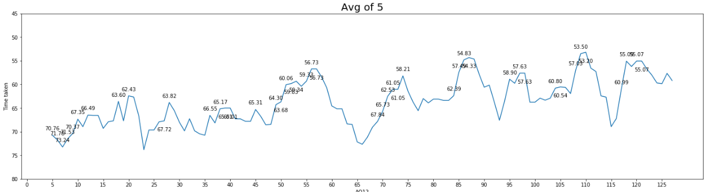
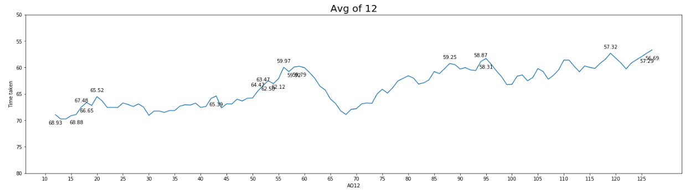
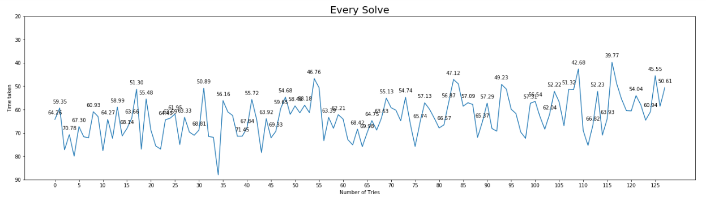

# speedcubing-analyser
This Python project is for generating graphs for your solves, averages &amp; personal bests.

This project utilizes the stats received as a JSON file from <a href="http://cstimer.net">cstimer.net</a>

Just point the folder where the file is located, on the first line of the code and let the code do its magic.

(Find an attached cstimer file for testing the project)

## Screenshots

